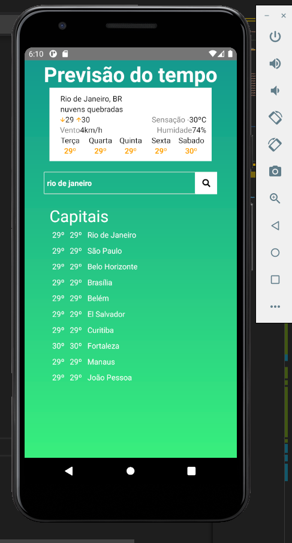

# react-native-weather-forecast

Praticando mais o react-native, fiz esse projeto que trás a previsão de 10 capitais no campo inferior 
No input basta digite o nome da cidade, de qualquer lugar do mundo que ele busca a previsão do mesmo, se não exibi uma mensagem "nada foi encontrado"

A api usada é openweathermap

<b>Api de previsão do tempo</b>

para rodar o projeto basta baixar o arquivo e yarn ou npm install para baixar as dependencias e depois npx react-native run-android (você vai precisar do android studio)
